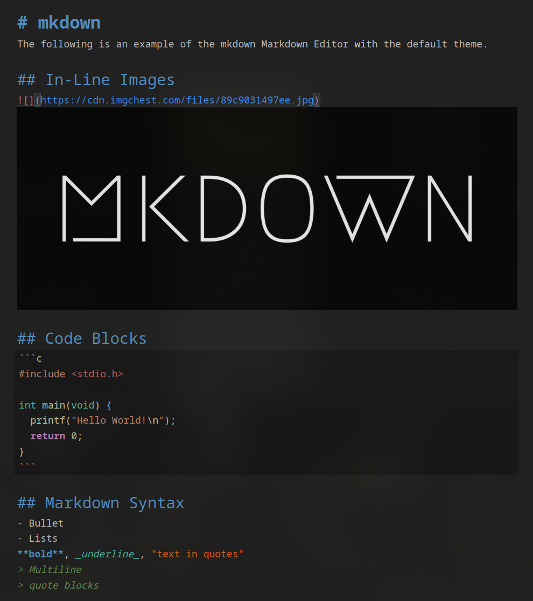

<h1 align="center">mkdown</h1>
<p align="center">A lightweight Markdown editor built on CodeMirror 6.</p>

### Features

* Syntax highlighted code blocks.

* Styled near-WYSIWYG markdown, including headings, bold, italics, lists, etc.

* In-line image embeddings.

In an effort to make markdown editing seamless, the end result is something resembling a mix between EasyMDE and Obsidian.md's live preview mode.

### Planned Features

* Theme selection via VS Code's settings (WIP) and increasing overall customizability.

* More functional code blocks

* Fix minor issues with syncing when saving.

### Showcase



### Usage

* Right click a .md file to open in mkdown.

* Right click in the explorer bar and select open in mkdown.

* Search `mkdown` in the command palette with `Cmd/Ctrl + Shift + P`.

Optionally, if you want to use mkdown as your default markdown editor, you can add this config into your settings:

```
"workbench.editorAssociations": {
    "*.md": "mkdown.editor"
}
```

### Developers

1. `git clone https://github.com/axshb/mkdown.git`
2. `cd mkdown`
3. `pnpm install`
4. `pnpm run compile`
5. Run with your method of choice. On VS Code, Press `F5` and run the extension for testing.
6. Compile the .vsix with `pnpm run package.`

